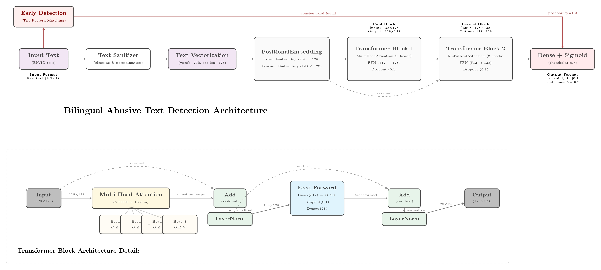

# Bilingual Abusive Text Detection Engine



A content moderation engine designed to maintain professional standards in our tutor-finding platform. Supports both English and Indonesian languages.

## Overview

This engine helps maintain quality and professionalism in our platform by:

- Detecting inappropriate content in tutor course offerings
- Moderating student reviews of tutors
- Supporting both English and Indonesian content
- Providing real-time content validation before publication

## Features

- Dual language support (English and Indonesian)
- Fast response time for real-time validation
- High accuracy text classification
- Early detection system for obvious violations
- Character substitution detection
- Batch processing capability for multiple reviews/courses

## Technical Details

### Datasets

The model is trained on carefully curated datasets:

- **Indonesian Dataset**: [Indonesian Abusive and Hate Speech Twitter Text](https://www.kaggle.com/datasets/ilhamfp31/indonesian-abusive-and-hate-speech-twitter-text/data)

- **English Dataset**: [Hate Speech and Offensive Language Detection](https://www.kaggle.com/datasets/thedevastator/hate-speech-and-offensive-language-detection/data)

### Project Structure

```
.
├── data/                  # Training datasets and word lists
├── models/               # Trained models and configurations
├── notebook/            # Development and training notebooks
└── web/                 # API implementation
```

## Model Architecture

### Overview

The model uses a hybrid approach combining deep learning with traditional pattern matching for robust abusive text detection:

1. **Early Detection System**: Fast pattern matching using optimized Trie data structures
2. **Deep Learning Model**: Transformer-based architecture for nuanced content analysis

### Components

#### 1. Early Detection System

- Uses an optimized Trie data structure for O(n) word matching
- Handles character substitutions (leetspeak): e.g., "a" → "4", "i" → "1"
- Maintains separate Tries for English and Indonesian word lists
- Performs text sanitization and normalization

#### 2. Deep Learning Model Architecture

```
Input Text → Vectorization → Positional Embedding → Transformer Blocks → Dense → Output
```

Key Components:

##### Text Vectorization

- Maximum sequence length: 128 tokens
- Vocabulary size: 20,000 tokens
- Handles both English and Indonesian text

##### Positional Embedding Layer

- Combines token embeddings with position information
- Embedding dimension: 128
- Learns position-aware representations

##### Transformer Blocks

- 2 transformer blocks with:
  - Multi-head attention (8 heads)
  - Feed-forward network (512 units)
  - Layer normalization
  - Dropout (0.1)
- Regularization: L2 (0.01)

##### Output Layer

- Dense layer with sigmoid activation
- Binary classification (abusive/non-abusive)

### Working Mechanism

1. **Text Processing Pipeline**:

   ```
   Raw Text → Sanitization → Early Detection → Deep Learning Analysis → Final Decision
   ```

2. **Decision Flow**:

   - Input text is first sanitized (remove special characters, normalize spacing)
   - Early detection system checks for known abusive words
   - If early detection fails, the deep learning model processes the text
   - Confidence threshold (default 0.7) determines final classification

3. **Confidence Scoring**:

   - Probability scores are converted to confidence values
   - Confidence = |probability - 0.5| \* 2
   - Higher confidence required for positive (abusive) classifications

4. **Batch Processing**:
   - Optimized for multiple text inputs
   - Early detection runs first to filter obvious cases
   - Remaining texts are batched for model inference
   - Results are reordered to match input sequence

## Installation

1. Clone the repository:

```bash
git clone https://github.com/yourusername/bilingual-abusive-detection.git
cd bilingual-abusive-detection
```

2. Install dependencies:

```bash
pip install -r requirements.txt
```

3. Start the API server:

```bash
granian web.main:app --host 0.0.0.0 --port 8000 --interface asgi
```

## API Usage

### Single Text Validation

Used for individual course descriptions or reviews

```python
POST /predict
{
    "text": "Tutor course description or student review text"
}
```

### Batch Processing

Used for validating multiple reviews or course descriptions

```python
POST /predict_batch
{
    "texts": ["course description 1", "student review 1", "course description 2"]
}
```

### Response Format

#### Non-Abusive Text Example

```json
{
  "text": "I had a great learning experience with this tutor. The teaching methods are effective and the explanations are very clear. Highly recommended for anyone studying calculus.",
  "probability": 0.12,
  "is_abusive": false,
  "confidence": 0.76,
  "early_detection": false,
  "matched_words": []
}
```

#### Abusive Text Example

```json
{
  "text": "This tutor is stup* as hell! Don't waste your money on this b*, total garbage teaching.",
  "probability": 0.97,
  "is_abusive": true,
  "confidence": 0.94,
  "early_detection": true,
  "matched_words": ["stup*", "b*"]
}
```

The response fields indicate:

- `text`: The original input text
- `probability`: Likelihood of the text being abusive (0 to 1)
- `is_abusive`: Boolean flag indicating if the text is classified as abusive
- `confidence`: Confidence level of the classification (0 to 1)
- `early_detection`: Whether abusive content was detected through word matching
- `matched_words`: List of abusive words found in the text (if any)

## API Documentation

After starting the server:

- Swagger UI: `http://localhost:8000/docs`
- ReDoc: `http://localhost:8000/redoc`
